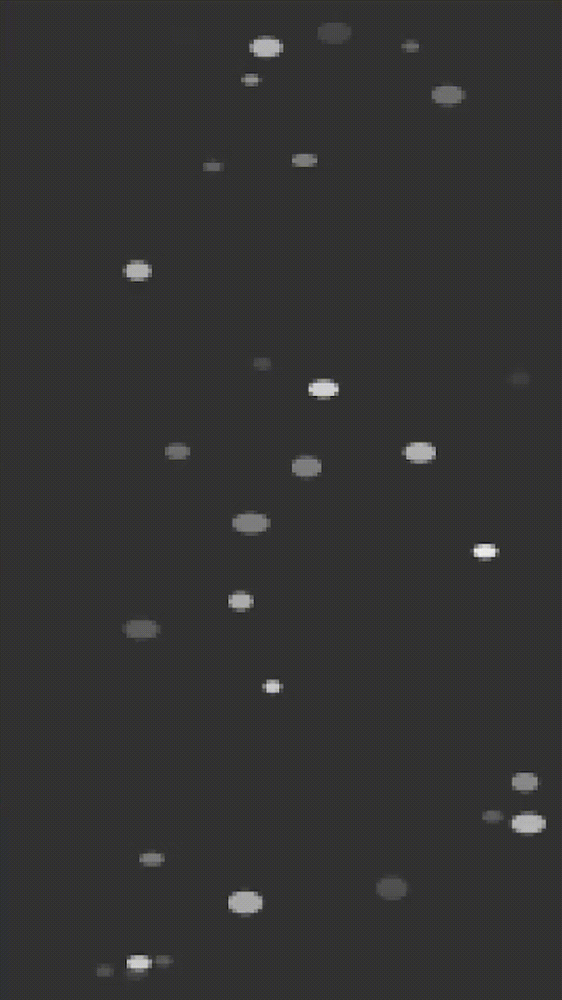

# Raindrops
Made with [Processing](https://processing.org/).

## Running
Install [Processing](https://processing.org/) and then open the file `raindrops/raindrops.pde` with it. Press the Play icon to run the file.

## Description
Each raindrop (a fading oval on the screen) is represented by a `Raindrop` object.

The `draw()` function is a built-in Processing function which updates the display every frame. Each frame, the display is wiped out with the background color, the raindrops are drawn, and then a pixelation filter is applied to give it a fun pixelated effect (I like pixel art).

Each frame the window updates, the raindrops also fade a little bit more. In other words, the opacity of the raindrop oval is decremented each frame. Each raindrop is instanced with a different random starting opacity, so that when the window is initialized, it appears as though the effect has already been running and you just jumped into it.

The pixelation filter was made by taking a convolution over the window, setting each chunk's color to the average color of the chunk to give the blocked out effect.

## Parameters
- `nRaindrops`: define the number of raindrops to be on the screen
- `squishiness`: define the base width to height ratio of the raindrop oval
- `squishinessRandFactor`: define the maximum range of randomness to add to the sqishiness value. More `squishinessRandFactor` means that the raindrops will tend to have dramatically different proportions.
- `raindropBW`: change the default raindrop color (on a scale of 0-255, white to black)
- `raindropDiameterMin`/`raindropDiameterMax`: defines the range of raindrop diameters possible. Note that margin was added based around `raindropDiameterMax` that a raindrop should never touch the edge of the window.
- `bgColor`: the background color of the window (on a scale of 0-255, white to black)
- `cellSize`: modify how dramatic the pixelation effect is (bigger `cellSize` means bigger 'pixel' chunks)
- `size(1080,1920)`: change the width, height of the window by modifying the values here within the `setup()` function. Note that `size()` is a Processing keyword, and so if you want to do anything fancy with it other than just plugging in new numbers, you may want to read the [size() documentation](https://processing.org/reference/size_.html).

